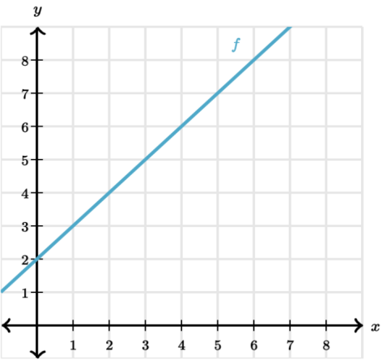
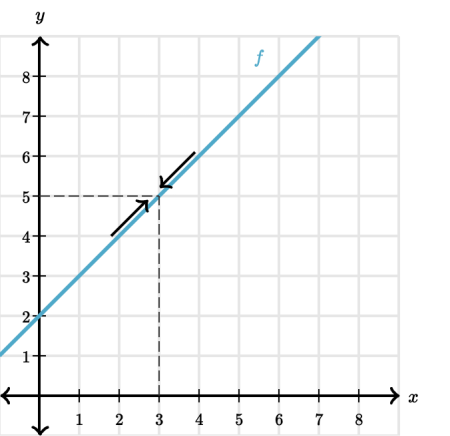
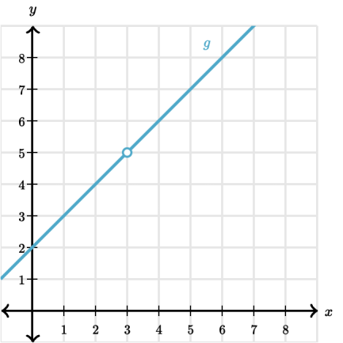

Limits describe how a function behaves near a point, instead of at that point. This simple yet powerful idea is the basis of all of calculus.

To understand what limits are, let's look at an example. We start with the function f(x)=x+2 is graphed.
The x-axis goes from 0 to 9. The graph consists of a line starting at (0, 2) and moving upward through (2,4) and (4, 6), and ending at (7,9).

Function f is graphed. The x-axis goes from 0 to 9. The graph consists of a line starting at (0, 2) and moving upward through (2,4) and (4, 6), and ending at (7,9).

The limit of f at x=3, equals, 3 is the value f approaches as we get closer and closer to x=3 , equals, 3. Graphically, this is the y-value we approach when we look at the graph of fand get closer and closer to the point on the graph where x=3.

For example, if we start at the point (1,3) and move on the graph until we get really close to x=3, equals, 3, then our y-value (i.e. the function's value) gets really close to 5.

Similarly, if we start at (5,7) and move to the left until we get really close to x=3 the y-value again will be really close to 5.

For these reasons we say that the limit of f at x=3 is 5.

You might be asking yourselves what's the difference between the limit of f at x=3 and the value of f at x=3 i.e. f(3).
So yes, the limit of f(x)=x+2 at x=3x=3x, equals, 3 is equal to f(3), but this isn't always the case.
To understand this, let's look at function g. This function is the same as f in every way except that it's undefined at x=3.

